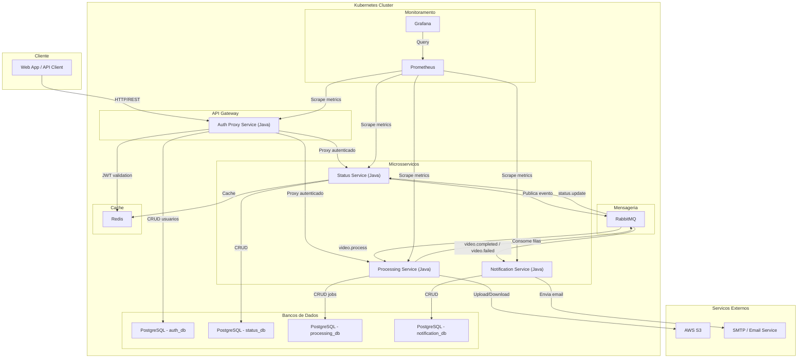
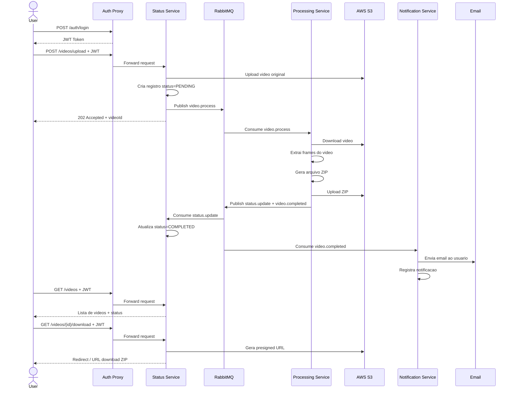
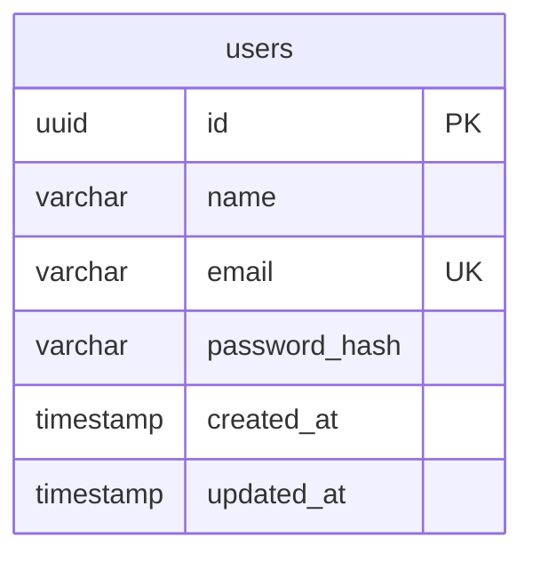
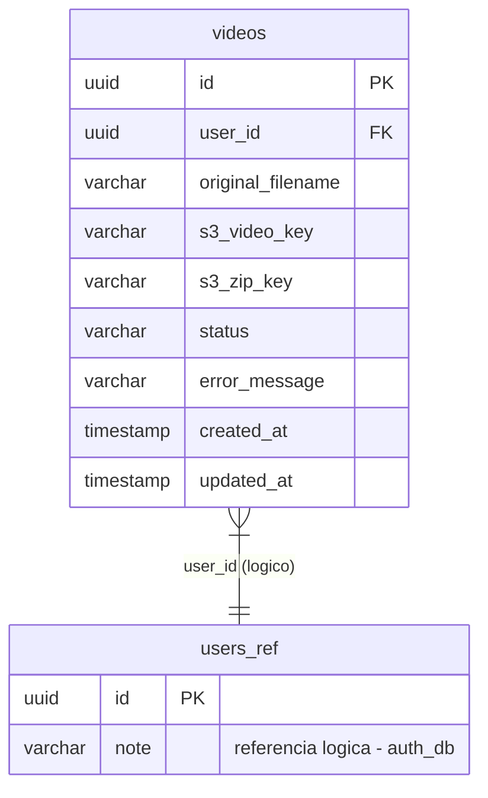
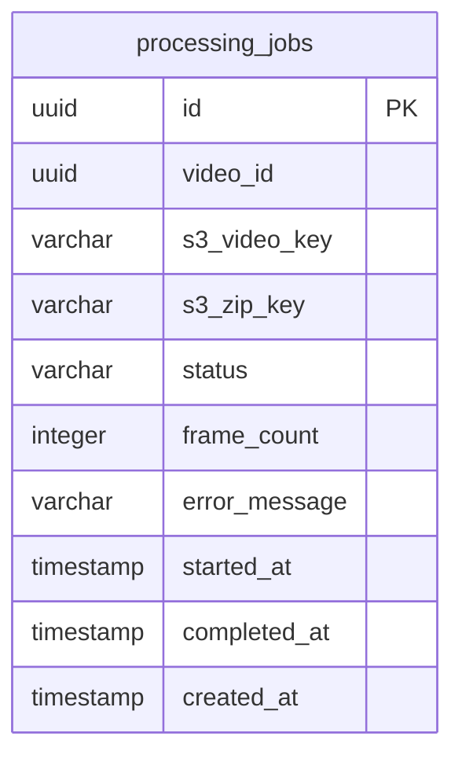
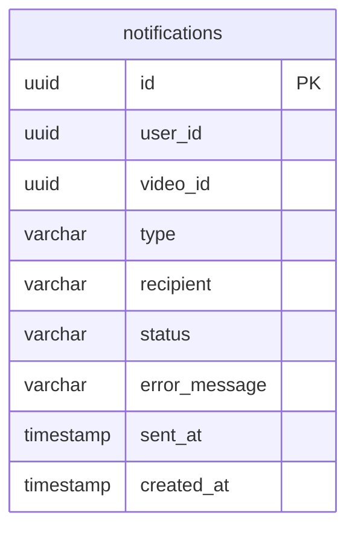
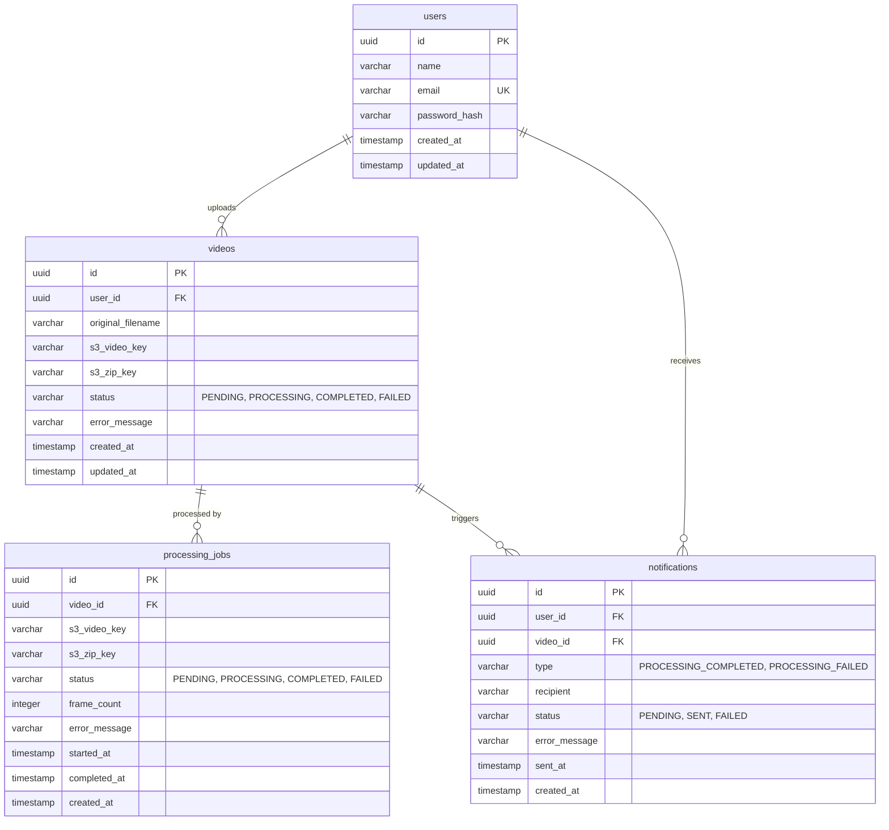
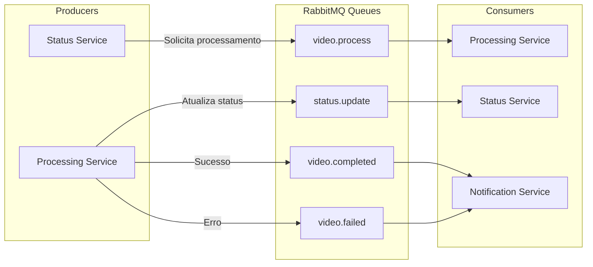
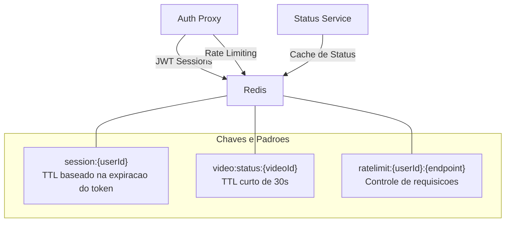
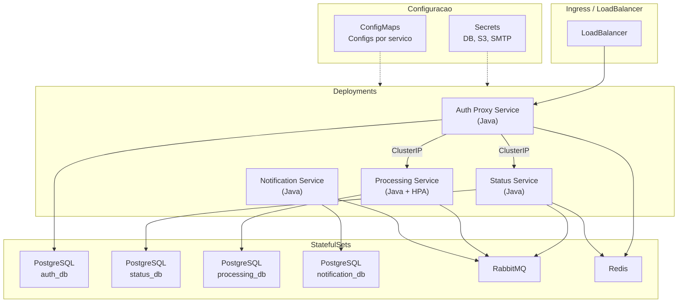

# Diagramas de Banco de Dados e Arquitetura - FIAP X

## Decisões de Arquitetura

- **Storage de arquivos**: AWS S3
- **Mensageria**: RabbitMQ 
- **Banco de dados**: Database per service (cada microsserviço com seu próprio schema PostgreSQL)
- **Cache**: Redis (sessões de autenticação + cache de status)

---

## Diagrama de Arquitetura

O sistema segue uma arquitetura de microsserviços orquestrada via Kubernetes, com comunicação assíncrona via RabbitMQ e storage de arquivos no AWS S3.

### Fluxo Principal

---

## Diagrama de Banco de Dados (ERD)

Cada microsserviço possui seu próprio banco de dados PostgreSQL (database-per-service pattern).

### auth_db (Auth Proxy Service)

### status_db (Status Service)

O campo `status` assume os valores: `PENDING`, `PROCESSING`, `COMPLETED`, `FAILED`.

### processing_db (Processing Service)

### notification_db (Notification Service)

O campo `type` assume: `PROCESSING_COMPLETED`, `PROCESSING_FAILED`. O campo `status` assume: `PENDING`, `SENT`, `FAILED`.

### Visão Consolidada do ERD

---

## Filas RabbitMQ

## Estrutura do Redis

---

## Infraestrutura Kubernetes

