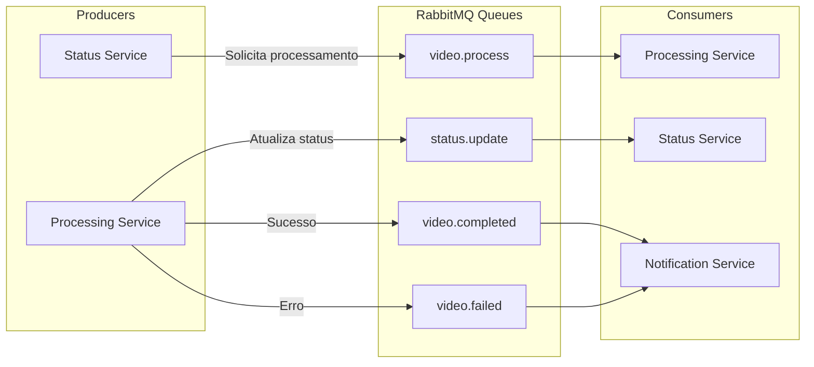
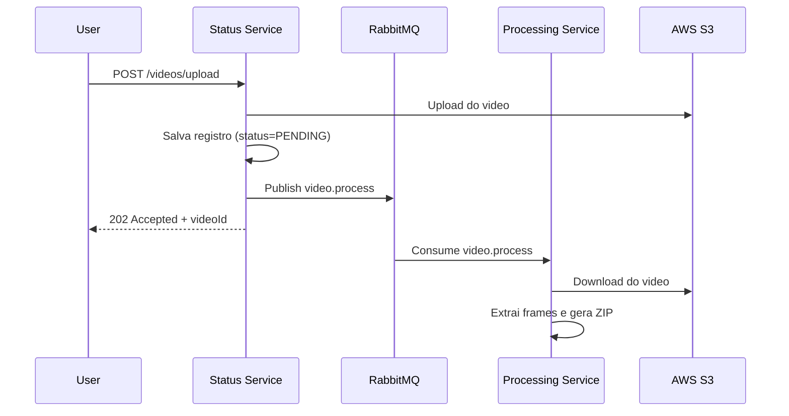
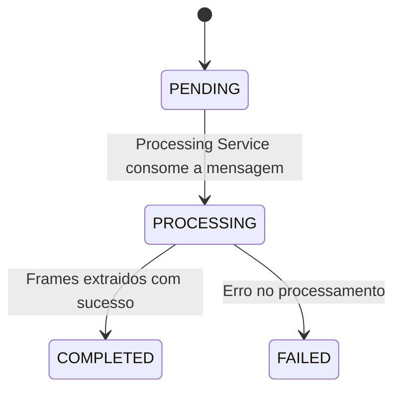
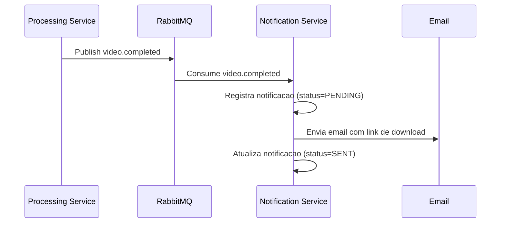
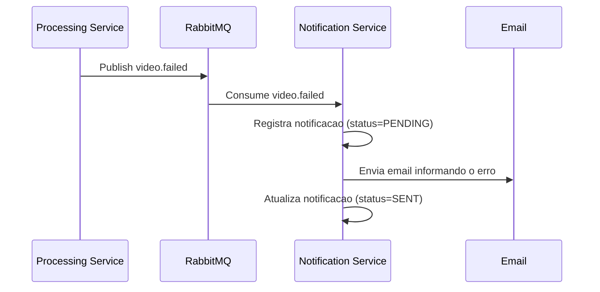

# Filas RabbitMQ - FIAP X

O RabbitMQ é o broker de mensageria do sistema, responsável pela comunicação assíncrona entre os microsserviços. Ele desacopla os serviços e garante que nenhuma requisição seja perdida em caso de picos de demanda.



---

## Por que usar filas?

Sem mensageria, o fluxo seria síncrono: o usuário faria upload de um vídeo e ficaria esperando o processamento terminar para receber a resposta. Isso causaria timeouts, travamentos e perda de requisições em picos de carga.

Com o RabbitMQ, o fluxo se torna assíncrono:

1. O usuário faz upload e recebe uma resposta imediata (HTTP 202 Accepted)
2. A mensagem entra na fila e fica **persistida em disco** até ser consumida
3. O Processing Service consome no seu próprio ritmo, sem pressão do cliente
4. Se o Processing Service cair, as mensagens ficam na fila até ele voltar

Isso atende diretamente ao requisito: **"Em caso de picos, o sistema não deve perder uma requisição"**.

---

## Filas do Sistema

### 1. video.process

| Campo | Descrição |
|-------|-----------|
| **Producer** | Status Service |
| **Consumer** | Processing Service |
| **Gatilho** | Usuário faz upload de um vídeo |
| **Durable** | Sim (persistida em disco) |

#### Propósito

Enfileira solicitações de processamento de vídeo. Quando o usuário faz upload, o Status Service salva o registro no banco com status `PENDING`, faz upload do vídeo para o S3 e publica uma mensagem nesta fila. O Processing Service consome a mensagem e inicia a extração de frames.

#### Payload

```json
{
  "videoId": "a1b2c3d4-e5f6-7890-abcd-ef1234567890",
  "userId": "550e8400-e29b-41d4-a716-446655440000",
  "s3VideoKey": "videos/a1b2c3d4-e5f6-7890-abcd-ef1234567890/original.mp4",
  "originalFilename": "apresentacao.mp4",
  "createdAt": "2026-02-09T10:05:00Z"
}
```

#### Fluxo



---

### 2. status.update

| Campo | Descrição |
|-------|-----------|
| **Producer** | Processing Service |
| **Consumer** | Status Service |
| **Gatilho** | Mudança de estado no processamento do vídeo |
| **Durable** | Sim (persistida em disco) |

#### Propósito

Notifica o Status Service sobre mudanças no processamento. Como cada microsserviço tem seu próprio banco de dados, o Processing Service não pode atualizar diretamente o registro de status no `status_db`. Em vez disso, ele publica uma mensagem nesta fila e o Status Service atualiza o seu banco.

#### Payload

```json
{
  "videoId": "a1b2c3d4-e5f6-7890-abcd-ef1234567890",
  "status": "COMPLETED",
  "s3ZipKey": "videos/a1b2c3d4-e5f6-7890-abcd-ef1234567890/frames.zip",
  "errorMessage": null,
  "updatedAt": "2026-02-09T10:08:30Z"
}
```

#### Transições de status possíveis



Cada transição gera uma mensagem na fila `status.update` com o novo valor de `status`.

---

### 3. video.completed

| Campo | Descrição |
|-------|-----------|
| **Producer** | Processing Service |
| **Consumer** | Notification Service |
| **Gatilho** | Processamento do vídeo finalizado com sucesso |
| **Durable** | Sim (persistida em disco) |

#### Propósito

Informa o Notification Service que um vídeo foi processado com sucesso, para que ele envie um e-mail ao usuário com o link de download do ZIP.

#### Payload

```json
{
  "videoId": "a1b2c3d4-e5f6-7890-abcd-ef1234567890",
  "userId": "550e8400-e29b-41d4-a716-446655440000",
  "originalFilename": "apresentacao.mp4",
  "s3ZipKey": "videos/a1b2c3d4-e5f6-7890-abcd-ef1234567890/frames.zip",
  "completedAt": "2026-02-09T10:08:30Z"
}
```

#### Fluxo



---

### 4. video.failed

| Campo | Descrição |
|-------|-----------|
| **Producer** | Processing Service |
| **Consumer** | Notification Service |
| **Gatilho** | Erro durante o processamento do vídeo |
| **Durable** | Sim (persistida em disco) |

#### Propósito

Informa o Notification Service que houve uma falha no processamento, para que ele envie um e-mail ao usuário informando o erro. Isso atende ao requisito: **"Em caso de erro, um usuário pode ser notificado"**.

#### Payload

```json
{
  "videoId": "a1b2c3d4-e5f6-7890-abcd-ef1234567890",
  "userId": "550e8400-e29b-41d4-a716-446655440000",
  "originalFilename": "apresentacao.mp4",
  "errorMessage": "Formato de video nao suportado: .avi",
  "failedAt": "2026-02-09T10:06:15Z"
}
```

#### Fluxo



---

## Configurações Recomendadas

### Durabilidade

Todas as filas são declaradas como **durable**, o que significa que sobrevivem a reinicializações do RabbitMQ. As mensagens também devem ser publicadas com `deliveryMode=2` (persistente) para garantir que sejam gravadas em disco.

### Acknowledgment

Os consumers devem usar **manual acknowledgment** (`basicAck`). A mensagem só é removida da fila quando o consumer confirma que terminou o processamento. Se o consumer cair antes do ack, o RabbitMQ re-enfileira a mensagem para outro consumer.

### Dead Letter Queue (DLQ)

Cada fila deve ter uma **Dead Letter Queue** associada. Mensagens que falham repetidamente (após N retentativas) são movidas para a DLQ em vez de serem descartadas:

| Fila Principal | Dead Letter Queue |
|----------------|-------------------|
| `video.process` | `video.process.dlq` |
| `status.update` | `status.update.dlq` |
| `video.completed` | `video.completed.dlq` |
| `video.failed` | `video.failed.dlq` |

Isso permite análise posterior de mensagens problemáticas sem perder dados.

### Prefetch Count

O `prefetchCount` controla quantas mensagens um consumer recebe por vez sem enviar ack. Valores recomendados:

| Consumer | Prefetch | Motivo |
|----------|----------|--------|
| Processing Service | 1 | Processamento pesado; uma mensagem por vez evita sobrecarga |
| Status Service | 10 | Atualizações leves; pode processar em lote |
| Notification Service | 5 | Envio de e-mail tem latência de rede; equilíbrio entre throughput e carga |
