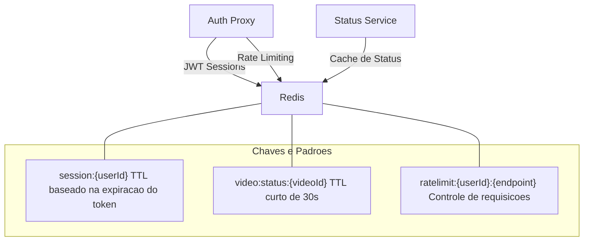

# Estrutura do Redis - FIAP X

O Redis é utilizado como camada de cache e controle em memória, atendendo três propósitos distintos no sistema: gerenciamento de sessões JWT, cache de status de vídeos e rate limiting de requisições.



---

## 1. Sessões JWT

**Padrão da chave**: `session:{userId}`

| Campo | Descrição |
|-------|-----------|
| **Serviço** | Auth Proxy |
| **Tipo** | String |
| **TTL** | Mesmo tempo de expiração do token JWT |
| **Operações** | `SET` no login, `GET` na validação, `DEL` no logout |

### Propósito

Permite a revogação de tokens JWT antes da sua expiração natural. Quando um usuário faz login, o token é registrado no Redis. A cada requisição autenticada, o Auth Proxy verifica se a sessão ainda existe no Redis. Se o token foi revogado (logout, troca de senha, bloqueio de conta), a chave é removida e o token passa a ser rejeitado mesmo que ainda não tenha expirado.

### Exemplo de uso

```
SET session:550e8400-e29b-41d4-a716-446655440000 '{"token":"eyJhbGci...","createdAt":"2026-02-09T10:00:00Z"}' EX 3600
GET session:550e8400-e29b-41d4-a716-446655440000
DEL session:550e8400-e29b-41d4-a716-446655440000
```

---

## 2. Cache de Status de Vídeos

**Padrão da chave**: `video:status:{videoId}`

| Campo | Descrição |
|-------|-----------|
| **Serviço** | Status Service |
| **Tipo** | Hash |
| **TTL** | 30 segundos |
| **Operações** | `HSET` na atualização de status, `HGETALL` na listagem, `DEL` na mudança de status |

### Propósito

Reduz a carga no PostgreSQL para consultas frequentes de status de vídeos. Quando um usuário acessa a listagem de vídeos, o Status Service primeiro verifica o Redis. Se a chave existe e não expirou, retorna o dado do cache sem consultar o banco. O TTL curto de 30 segundos garante que os dados não fiquem desatualizados por muito tempo.

### Campos armazenados

| Campo | Tipo | Descrição |
|-------|------|-----------|
| `status` | String | PENDING, PROCESSING, COMPLETED, FAILED |
| `originalFilename` | String | Nome original do arquivo de vídeo |
| `createdAt` | String | Data de criação do registro |
| `errorMessage` | String | Mensagem de erro (se houver) |

### Exemplo de uso

```
HSET video:status:a1b2c3d4-e5f6-7890-abcd-ef1234567890 status "PROCESSING" originalFilename "video.mp4" createdAt "2026-02-09T10:05:00Z"
EXPIRE video:status:a1b2c3d4-e5f6-7890-abcd-ef1234567890 30
HGETALL video:status:a1b2c3d4-e5f6-7890-abcd-ef1234567890
```

### Invalidação

Quando o Processing Service publica uma mensagem na fila `status.update`, o Status Service atualiza o banco de dados e remove a chave correspondente do Redis para evitar dados stale:

```
DEL video:status:a1b2c3d4-e5f6-7890-abcd-ef1234567890
```

---

## 3. Rate Limiting

**Padrão da chave**: `ratelimit:{userId}:{endpoint}`

| Campo | Descrição |
|-------|-----------|
| **Serviço** | Auth Proxy |
| **Tipo** | String (contador) |
| **TTL** | Janela de tempo configurável (ex: 60 segundos) |
| **Operações** | `INCR` a cada requisição, `GET` para verificar limite |

### Propósito

Protege os microsserviços contra uso abusivo, limitando o número de requisições por usuário em uma janela de tempo. O Auth Proxy incrementa o contador a cada requisição e rejeita com HTTP 429 (Too Many Requests) quando o limite é atingido.

### Limites sugeridos

| Endpoint | Limite | Janela |
|----------|--------|--------|
| `POST /videos/upload` | 10 requisições | 60 segundos |
| `GET /videos` | 60 requisições | 60 segundos |
| `GET /videos/{id}/download` | 30 requisições | 60 segundos |

### Exemplo de uso (algoritmo Fixed Window)

```
INCR ratelimit:550e8400-e29b-41d4-a716-446655440000:/videos/upload
EXPIRE ratelimit:550e8400-e29b-41d4-a716-446655440000:/videos/upload 60
GET ratelimit:550e8400-e29b-41d4-a716-446655440000:/videos/upload
```

Se o valor retornado pelo `GET` exceder o limite configurado para o endpoint, a requisição é rejeitada com status 429.
